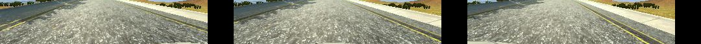

Behavioral Cloning Project
==============================


<!--
(setq markdown-command "pandoc -s --self-contained -t html5 -c github.css --toc --toc-depth=4")
->


[//]: # (Image References)
[image1]: ./examples/placeholder.png "Model Visualization"
[image2]: ./examples/placeholder.png "Grayscaling"
[image3]: ./examples/placeholder_small.png "Recovery Image"
[image4]: ./examples/placeholder_small.png "Recovery Image"
[image5]: ./examples/placeholder_small.png "Recovery Image"
[image6]: ./examples/placeholder_small.png "Normal Image"
[image7]: ./examples/placeholder_small.png "Flipped Image"
-->

---

##1. Files Submitted & Code Quality

###1.1. Submission includes all required files and can be used to run the simulator in autonomous mode

My project includes the following files:

* model.py containing the script to create and train the model
* drive.py for driving the car in autonomous mode
* model.h5 containing a trained convolution neural network 
* writeup_report.md and writeup_report.pdf summarizing the results
* video.mp4 revealing the model is available for track 1 and 2


###1.2. Submission includes functional code

Using the Udacity provided simulator and my drive.py file, 
the car can be driven autonomously around the track by executing 

```sh
python drive.py model.h5
```

This model is adapted to both of track 1 and 2.


###1.3. Submission code is usable and readable

The model.py file contains the code for training and saving the convolution neural network.  
The file shows the pipeline I used for training and validating the model, 
the generator to save memories when training and validating are executed with huge umber of dataset,
the graph plot code to output the loss curve of each training and validation,
and it contains comments to explain how the code works.


##2. Model Architecture and Training Strategy

###2.1. Feasibility study in model architectures
<!-- ##2.1. Appropriate models architecture has been employed -->

Before designing a model, I had tests on typical models explained in "Behavioral Cloning" lesson as follow.

  1. flat model
  2. LeNet model
  3. NVIDIA model (PilotNet)

These models are defined as following:

#### Flat model

	# flat model
    model = Sequential()
    model.add(Lambda(lambda x: (x / 255.0) - 0.5, input_shape=(160, 320, 3)))
    model.add(Cropping2D(cropping=((70, 20), (0, 0))))
    model.add(Flatten())
    model.add(Dense(100))
    model.add(Dropout(0.5))
    model.add(Dense(50))
    model.add(Dropout(0.5))
    model.add(Dense(10))
    model.add(Dropout(0.5))
    model.add(Dense(1))

#### LeNet model

    # LeNet model
    model = Sequential()
    model.add(Lambda(lambda x: (x / 255.0) - 0.5, input_shape=(160, 320, 3)))
    model.add(Cropping2D(cropping=((70, 20), (0, 0))))
    model.add(Convolution2D(20, 5, 5, subsample=(1, 1), activation='relu'))
    model.add(MaxPooling2D((2, 2)))
    model.add(Dropout(0.25))
    model.add(Convolution2D(50, 5, 5, subsample=(1, 1), activation='relu'))
    model.add(MaxPooling2D((2, 2)))
    model.add(Dropout(0.25))
    model.add(Flatten())
    model.add(Dense(100, activation='relu'))
    model.add(Dropout(0.5))
    model.add(Dense(50, activation='relu'))
    model.add(Dropout(0.5))
    model.add(Dense(10, activation='relu'))
    model.add(Dropout(0.5))
    model.add(Dense(1))

#### NVIDIA model (PilotNet)

	# NVIDIA model (PilotNet)
    model = Sequential()
    model.add(Lambda(lambda x: (x / 255.0) - 0.5, input_shape=(160, 320, 3)))
    model.add(Cropping2D(cropping=((70, 20), (0, 0))))
    model.add(Convolution2D(24, 5, 5, subsample=(2, 2), activation='relu'))
    model.add(Convolution2D(36, 5, 5, subsample=(2, 2), activation='relu'))
    model.add(Convolution2D(48, 5, 5, subsample=(2, 2), activation='relu'))
    model.add(Convolution2D(64, 3, 3, activation='relu'))
    model.add(Convolution2D(64, 3, 3, activation='relu'))
    model.add(Flatten())
    model.add(Dense(100))
    model.add(Dense(50))
    model.add(Dense(10))
    model.add(Dense(1))


The three models are trained under the equal condition via following code.

	# training code is as follows
    model.compile(loss='mse', optimizer='adam')
    history = model.fit(X_train, y_train, validation_split=0.2, shuffle=True, nb_epoch=20, verbose=2)
    model.save('model.h5')

Training paramters are as follows.

|title|descriptions|
|:------:|:------
|dataset | distribution of Udacity
|camera| 3 (left, center, right)|
|crop| cropping=((70, 20), (0, 0))|
|loss | mse |
|optimizer  |ADAM
|epochs| 60|

All three models adopt multi camera image inputs.  
Left and right camera images are loaded as follow, and used as training datasets.

    import pandas as pd
    df = pd.read_csv(args.csvfile, header=0)
    
    images = []
    measurements = []
    for i, dat in df.iterrows():
        path = os.path.join(args.imgdir, dat[0])
    
        steering = float(dat[3])
    
        # center camera
        images.append(np.asarray(Image.open(os.path.join(args.imgdir, dat[0].strip()))))
        measurements.append(steering)
        # left camera
        images.append(np.asarray(Image.open(os.path.join(args.imgdir, dat[1].strip()))))
        measurements.append(steering + 0.2)
        # right camera
        images.append(np.asarray(Image.open(os.path.join(args.imgdir, dat[2].strip()))))
        measurements.append(steering - 0.2)
    
    X_train = np.array(images)
    y_train = np.array(measurements)


Following figures show training curves of each models.  
PilotNet is obviously overfitted, but its loss value is extremely smaller than other models.


###2.2. Attempts to reduce overfitting in the model

From the result of the feasibility study, I took PilotNet to apply to the project.  
Original PilotNet is as below. (my final model is described in the next section)


#### Adding dropout layers

To prevent overfitting, I had a study to estimate place and times of dropout to add into PilotNet.

Following figures show learning cirves of two ways to add Dropout layers.  
Left graph is a case that dropouts are inserted every after FC layers.  
Right graph is a case that dropouts are inserted every after FC layers and CNNs.


Some studies said that adding dropouts into all after layers is effective, but it is not so remarkable in this case.
But more dropout seems to cause more fluency of training curve.


#### Shrinking PilotNet

This PilotNet implementation seems to be too large for our purpose, 
relative to the NVIDIA paper "Explaining How a Deep Neural Network Trained with End-to-End Learning Steers a Car".
On the other hand, both of the project and PilotNet have similar input image size,
the feature map of PilotNet then would work well for the project, too.  
So I deceided to shrink the fully-connected layers (dense layers) of the PilotNet to prevent overfitting.


###2.3. Detail of the final model

Following table shows the detail of my final model.

| Layer         		|     Description	        					| 
|:----------------------|:----------------------------------------------| 
| Input         		| 160x320x3 RGB image							| 
| Normalization    		| via lambda x: (x / 255.0) - 0.5				| 
| Crop           		| 70x320x3 RGB image, offset (0, 70)			| 
| Convolution 5x5     	| 2x2 stride, outputs 24@33x158					|
| RELU					|												|
| Convolution 5x5     	| 2x2 stride, outputs 36@15x77					|
| RELU					|												|
| Convolution 5x5     	| 2x2 stride, outputs 48@6x37					|
| RELU					|												|
| Dropout				| keep prob. 0.25								|
| Convolution 3x3     	| 1x1 stride, outputs 64@4x35					|
| RELU					|												|
| Dropout				| keep prob. 0.25								|
| Convolution 3x3     	| 1x1 stride, outputs 64@2x33					|
| RELU					|												|
| Dropout				| keep prob. 0.25								|
| flatten				| 2x44x64 => 5632  								|
| Fully connected		| outputs 50  									|
| Dropout				| keep prob. 0.5								|
| Fully connected		| outputs 20  									|
| Dropout				| keep prob. 0.5								|
| Output				| outputs 1  									|

My final model consists of five convolution neural networks and two Fully connected networks.  
The geometry of the CNN layers are really similar to PilotNet, as the table above, 
therefore its feature maps are expected to work as well as PilotNet. 

I inserted dropout layers after last two CNN layers with keep prob. 0.25,
and after first two Fully connected layers with keep prob. 0.5.  
These Dropout layers pretty prevented overfitting.

And the size of the two fully connected layers are far shrinked than PilotNet.  
It is also efficient to avoid overfitting.

Following figure shows my final model.


The model was trained and validated on different data sets to ensure that the model was not overfitting.  
Both of the dataset shuffled via "sklearn.utils.shuffle" function before training.

The model was tested by running it through the simulator and ensuring that the vehicle could stay on the track.


###2.4. Model parameter tuning

The model used an adam optimizer, so the learning rate was not tuned manually (model.py line 25).


###2.5. Appropriate training data

#### Multi cameras use

I had a test beforehand to confirm potentiality of single camera use and multi cameras use.  
Following scene shows the car can run over at the sharp corner with uncertain curb, if input camera is single.


When the model was trained with multi cameras, the car never run over at the corner and keeps on the road of track 1 at least one hour.


Here are the example images input from the three cameras.


<!--  -->


The multi input images are cropped at the first section of the final model like following pictures, 
although the actual input images are normalized before cropping.


<!--  -->


In training process,
left and right images are treated in similar ways with center image
*expect their steering angle value* .  
This is same as the method that the lesson showed us.
And I set steer_offset to 0.3 after some studies.
(actually this value weren't sensitive.)

	# steer_offset is set to 0.3
	
    # center camera
    images.append(np.asarray(Image.open(os.path.join(args.imgdir, dat[0].strip()))))
    angles.append(steering)
    # left camera
    images.append(np.asarray(Image.open(os.path.join(args.imgdir, dat[1].strip()))))
    angles.append(steering + steer_offset)
    # right camera
    images.append(np.asarray(Image.open(os.path.join(args.imgdir, dat[2].strip()))))
    angles.append(steering - steer_offset)

#### Making datasets for each track

Training curve of the provided dataset is as following.  
The final model works well and drives around track 1 after traininig with the dataset,
but of course it is not adaptive to track 2.


At first I made two dataset for each track 1 and 2.

Training curve of my datset for track 1 is as following.


Training curve of my datset for track 2 is as following.


The two dataset were enough to train the final model to work for each track.  
And the car runs around the each track along the center of its road.

At track 2, I tried to make the car keep to the right lane.


#### Ensuring the compatibility with both track 1 and track 2

At first I tried simple unification of the two dataset, and it works for track 1 but not for track 2.  
So, until the model works well for the both two tracks, I augmented training data at every problematic curves.

For example, 
the car was sometimes caught in poles standing at the edge of the sharp corner as follows.


Then I added or replaced training images at the corner by the simulator as follows.


<!-- -->

After many repetitions of such a operation,  I got the final dataset that work well on the both tracks.  
Therefore the final dataset became very large.

Training curve of the final datset is as following.


#### Augmenting dataset via mirrored images

To argment the dataset efficiently, I used mirrored images of center camera via following code.

     # flipped images
     # center camera
     images.append(np.fliplr(np.asarray(Image.open(os.path.join(args.imgdir, dat[0].strip())))))
     angles.append(-steering)

About left and right camera, 
I could not find a good way to arrange the offset value of the steering angle for their mirror images.  
So I did not use the both side cameras.


#### Generator implementation

I implemented generator to have a lot of dataset as following code.  
This generator reduce the memory consumption, thus I could train the final model with a huge dataset.

    def generator(samples, batch_size=32, steer_offset=0.3):
        num_samples = len(samples)
        while 1:  # Loop forever so the generator never terminates
            sklearn.utils.shuffle(samples, replace=False)
            for offset in range(0, num_samples, batch_size):
                batch_samples = samples[offset:offset+batch_size]
    
                images = []
                angles = []
                for dat in batch_samples:
                    steering = float(dat[3])
                    # center camera
                    images.append(np.asarray(Image.open(os.path.join(args.imgdir, dat[0].strip()))))
                    angles.append(steering)
                    # left camera
                    images.append(np.asarray(Image.open(os.path.join(args.imgdir, dat[1].strip()))))
                    angles.append(steering + steer_offset)
                    # right camera
                    images.append(np.asarray(Image.open(os.path.join(args.imgdir, dat[2].strip()))))
                    angles.append(steering - steer_offset)
    
                    #
                    # flipped images
                    #
                    # center camera
                    images.append(np.fliplr(np.asarray(Image.open(os.path.join(args.imgdir, dat[0].strip())))))
                    angles.append(-steering)
    
                X_train = np.array(images)
                y_train = np.array(angles)
                yield sklearn.utils.shuffle(X_train, y_train)


## Conclusion


- designed the model like PilotNet with three cameras
- made dataset adaptable to both track 1 and track 2
- run the model and dataset on the simulator, and record it in a video file

<!--
TODO ここから書く

Lastly,
I tried the large dataset shrinked, but

### Generalization with Small Dataset for both Track 1 and 2

I tried to reduce training dataset, because the completed dataset above is so large as to need long time to re-train.
This trial
-->

<!--


 -->

EOF


<!--
#3. Model Architecture and Training Strategy

###3.1. Solution Design Approach

The overall strategy for deriving a model architecture was to ...

My first step was to use a convolution neural network model similar to the ... I thought this model might be appropriate because ...

In order to gauge how well the model was working, I split my image and steering angle data into a training and validation set. I found that my first model had a low mean squared error on the training set but a high mean squared error on the validation set. This implied that the model was overfitting. 

To combat the overfitting, I modified the model so that ...

Then I ... 

The final step was to run the simulator to see how well the car was driving around track one. There were a few spots where the vehicle fell off the track... to improve the driving behavior in these cases, I ....

At the end of the process, the vehicle is able to drive autonomously around the track without leaving the road.


###3.2. Final Model Architecture

The final model architecture (model.py lines 18-24) consisted of a convolution neural network with the following layers and layer sizes ...

Here is a visualization of the architecture (note: visualizing the architecture is optional according to the project rubric)

![alt text][image1]


To capture good driving behavior, I first recorded two laps on track one using center lane driving. Here is an example image of center lane driving:

![alt text][image2]

I then recorded the vehicle recovering from the left side and right sides of the road back to center so that the vehicle would learn to .... These images show what a recovery looks like starting from ... :

![alt text][image3]
![alt text][image4]
![alt text][image5]

Then I repeated this process on track two in order to get more data points.

To augment the data sat, I also flipped images and angles thinking that this would ... For example, here is an image that has then been flipped:

![alt text][image6]
![alt text][image7]

Etc ....

After the collection process, I had X number of data points. I then preprocessed this data by ...


I finally randomly shuffled the data set and put Y% of the data into a validation set. 

I used this training data for training the model. The validation set helped determine if the model was over or under fitting. The ideal number of epochs was Z as evidenced by ... I used an adam optimizer so that manually training the learning rate wasn't necessary.


## Rubric Points

TODO

* [x] Use the simulator to collect data of good driving behavior
* [x] Build, a convolution neural network in Keras that predicts steering angles from images
* [x] Train and validate the model with a training and validation set
* [x] model.py モデルを作って、学習する
* [x] Test that the model successfully drives around track one without leaving the road
* [ ] model.h5 学習済みCNNを含む* 
* [x] drive.py 自動運転をさせる
* [ ] Summarize the results with a written report

- The submission includes 
  - [x] a model.py file
  - [x] drive.py
  - [x] model.h5
  - [ ] a writeup report
  - [ ] video.mp4

- Quality of Code
  - Is the code functional?
    - The model provided can be used to successfully operate the simulation.
  - Is the code usable and readable?
    - The code in model.py uses a Python generator, if needed, to
      generate data for training rather than storing the training data
      in memory. The model.py code is clearly organized and comments
      are included where needed.

Model Architecture and Training Strategy

- Has an appropriate model architecture been employed for the task?
  - The neural network uses convolution layers with appropriate filter sizes.
    Layers exist to introduce nonlinearity into the model. 
    The data is normalized in the model.

- Has an attempt been made to reduce overfitting of the model?
  - Train/validation/test splits have been used, and 
    the model uses dropout layers or other methods to reduce overfitting.

- Have the model parameters been tuned appropriately?
  - Learning rate parameters are chosen with explanation, or an Adam optimizer is used.

- Is the training data chosen appropriately?
  - Training data has been chosen to induce the desired behavior in the simulation
    (i.e. keeping the car on the track).


Architecture and Training Documentation

- Is the solution design documented?
  - The README thoroughly discusses the approach taken for deriving and 
    designing a model architecture fit for solving the given problem.

- Is the model architecture documented?
  - The README provides sufficient details of the characteristics and qualities of the architecture,
    such as the type of model used, the number of layers, the size of each layer. 
    Visualizations emphasizing particular qualities of the architecture are encouraged.

- Is the creation of the training dataset and training process documented?
  - The README describes how the model was trained and what the characteristics of the dataset are.
    Information such as how the dataset was generated and examples of images from the dataset must be included.


Simulation

- Is the car able to navigate correctly on test data?
  - No tire may leave the drivable portion of the track surface.
    The car may not pop up onto ledges or roll over any surfaces that 
    would otherwise be considered unsafe (if humans were in the vehicle).


Suggestions to Make Your Project Stand Out!

- Track Two
  - The simulator contains two tracks. 
    To meet specifications, the car must successfully drive around track one. 
    Track two is more difficult. 
    See if you can get the car to stay on the road for track two as well.

-->
