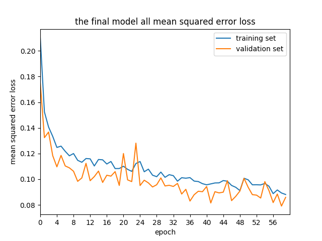
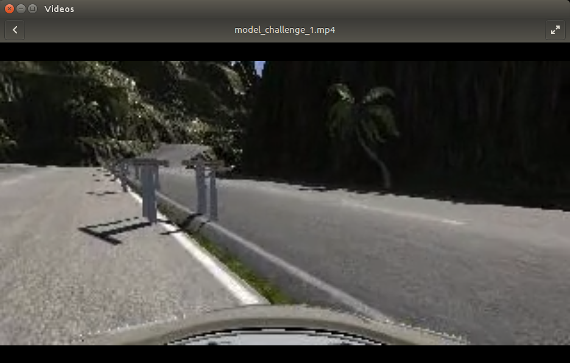

#**Behavioral Cloning Project**


<!--
[//]: # (Image References)
[image1]: ./examples/placeholder.png "Model Visualization"
[image2]: ./examples/placeholder.png "Grayscaling"
[image3]: ./examples/placeholder_small.png "Recovery Image"
[image4]: ./examples/placeholder_small.png "Recovery Image"
[image5]: ./examples/placeholder_small.png "Recovery Image"
[image6]: ./examples/placeholder_small.png "Normal Image"
[image7]: ./examples/placeholder_small.png "Flipped Image"
-->

---

#1. Files Submitted & Code Quality

##1.1. Submission includes all required files and can be used to run the simulator in autonomous mode

My project includes the following files:

* model.py containing the script to create and train the model
* drive.py for driving the car in autonomous mode
* model.h5 containing a trained convolution neural network 
* writeup_report.md or writeup_report.pdf summarizing the results


TODO Track2を追加するか、同じモデルで実現するか


##1.2. Submission includes functional code

Using the Udacity provided simulator and my drive.py file, 
the car can be driven autonomously around the track by executing 

```sh
python drive.py model.h5
```


##1.3. Submission code is usable and readable

The model.py file contains the code for training and saving the convolution neural network.
The file shows the pipeline I used for training and validating the model, 
and it contains comments to explain how the code works.


#2. Model Architecture and Training Strategy

##2.1. Feasibility Study in models architecture
<!-- ##2.1. Appropriate models architecture has been employed -->

Before designing a model, I had some tests on typical models explaned in "Behavioral Cloning" lesson as follow.

  1. flat model
  2. LeNet model
  3. NVIDIA model

These models are defined as following:

	# flat model
    model = Sequential()
    model.add(Lambda(lambda x: (x / 255.0) - 0.5, input_shape=(160, 320, 3)))
    model.add(Cropping2D(cropping=((70, 20), (0, 0))))
    model.add(Flatten())
    model.add(Dense(100))
    model.add(Dropout(0.5))
    model.add(Dense(50))
    model.add(Dropout(0.5))
    model.add(Dense(10))
    model.add(Dropout(0.5))
    model.add(Dense(1))

	# LeNet model
    model = Sequential()
    model.add(Lambda(lambda x: (x / 255.0) - 0.5, input_shape=(160, 320, 3)))
    model.add(Cropping2D(cropping=((70, 20), (0, 0))))
    model.add(Convolution2D(20, 5, 5, subsample=(1, 1), activation='relu'))
    model.add(MaxPooling2D((2, 2)))
    model.add(Dropout(0.25))
    model.add(Convolution2D(50, 5, 5, subsample=(1, 1), activation='relu'))
    model.add(MaxPooling2D((2, 2)))
    model.add(Dropout(0.25))
    model.add(Flatten())
    model.add(Dense(100, activation='relu'))
    model.add(Dropout(0.5))
    model.add(Dense(50, activation='relu'))
    model.add(Dropout(0.5))
    model.add(Dense(10, activation='relu'))
    model.add(Dropout(0.5))
    model.add(Dense(1))

	# NVIDIA model
    model = Sequential()
    model.add(Lambda(lambda x: (x / 255.0) - 0.5, input_shape=(160, 320, 3)))
    model.add(Cropping2D(cropping=((70, 20), (0, 0))))
    model.add(Convolution2D(24, 5, 5, subsample=(2, 2), activation='relu'))
    model.add(Convolution2D(36, 5, 5, subsample=(2, 2), activation='relu'))
    model.add(Convolution2D(48, 5, 5, subsample=(2, 2), activation='relu'))
    model.add(Convolution2D(64, 3, 3, activation='relu'))
    model.add(Convolution2D(64, 3, 3, activation='relu'))
    model.add(Flatten())
    model.add(Dense(100))
    model.add(Dense(50))
    model.add(Dense(10))
    model.add(Dense(1))


They were trained under the equal condition and code as below.

|title|descriptions|
|:------:|:------
|dataset | distribution of Udacity
|camera| 3 (left, center, right)|
|crop| cropping=((70, 20), (0, 0))|
|loss | mse |
|optimizer  |ADAM
|epochs| 20|

	# training code is as follows
    model.compile(loss='mse', optimizer='adam')
    history = model.fit(X_train, y_train, validation_split=0.2, shuffle=True, nb_epoch=20, verbose=2)
    model.save('model.h5')


Left and right camera are loaded and used to model training as follow.

    import pandas as pd
    df = pd.read_csv(args.csvfile, header=0)
    
    images = []
    measurements = []
    for i, dat in df.iterrows():
        path = os.path.join(args.imgdir, dat[0])
    
        steering = float(dat[3])
    
        # center camera
        images.append(np.asarray(Image.open(os.path.join(args.imgdir, dat[0].strip()))))
        measurements.append(steering)
        # left camera
        images.append(np.asarray(Image.open(os.path.join(args.imgdir, dat[1].strip()))))
        measurements.append(steering + 0.2)
        # right camera
        images.append(np.asarray(Image.open(os.path.join(args.imgdir, dat[2].strip()))))
        measurements.append(steering - 0.2)
    
    X_train = np.array(images)
    y_train = np.array(measurements)


The three models have differences only in their layer structures, described above.

Following figures show the training curves of the three models.
NVIDIA model is obviously overfitted, but its loss value is extremely smaller than other models.


##2.2. Attempts to reduce overfitting in the model

From the result of the feasibility study, I decided to take the NVIDIA model and modify it.


TODO ここから書く

Dropout のテスト

keep feature map layer
shrink Fully-connected layer(dense layer)

because training signal is only steering, 
NVIDIA has 10 control signal


To prevent overfitting, I tried two ways to add Dropout layers.
Some papers said that adding dropout into all layers is effective, but it is not in this case.


To make learning curve smooth, 

ここにモデルの詳細説明を追加

dropout
shrink unit number of Dense layer

My model consists of a convolution neural network with 3x3 filter sizes and depths between 32 and 128 (model.py lines 18-24) 

The model includes RELU layers to introduce nonlinearity (code line 20), and the data is normalized in the model using a Keras lambda layer (code line 18). 

The model contains dropout layers in order to reduce overfitting (model.py lines 21). 

The model was trained and validated on different data sets to ensure that the model was not overfitting (code line 10-16). The model was tested by running it through the simulator and ensuring that the vehicle could stay on the track.


training curve with provided data


for my dataset
1 lap

this dataset has only 1/4 number of provided dataset yet

This model can drive a track
but seems to be a bit unstable nn


keep on the road at the problematic corner


In most cases, the vehicle fails to drive over a curb.
Once it gets away from the center of the road, it doesn't seem to recover itself particularly with uncertain road like below.


One lap training data


After training, model files written in h5 file by the each models were tested on the driving simulator.

These studies were almost failed.
NVIDIA model architecture sometimes drives all the track, and other model can not do at all.


##2.3. Model parameter tuning

The model used an adam optimizer, so the learning rate was not tuned manually (model.py line 25).


##2.4. Appropriate training data


Then
augment training data
increase 
to 16404 sample (49212 images)
it is about twice of provided dataset


いろいろ追加
data record
逆走
沢山追加


After augmentation 


Training data was chosen to keep the vehicle driving on the road. I used a combination of center lane driving, recovering from the left and right sides of the road ... 

For details about how I created the training data, see the next section. 


#3. Model Architecture and Training Strategy

##3.1. Solution Design Approach

The overall strategy for deriving a model architecture was to ...

My first step was to use a convolution neural network model similar to the ... I thought this model might be appropriate because ...

In order to gauge how well the model was working, I split my image and steering angle data into a training and validation set. I found that my first model had a low mean squared error on the training set but a high mean squared error on the validation set. This implied that the model was overfitting. 

To combat the overfitting, I modified the model so that ...

Then I ... 

The final step was to run the simulator to see how well the car was driving around track one. There were a few spots where the vehicle fell off the track... to improve the driving behavior in these cases, I ....

At the end of the process, the vehicle is able to drive autonomously around the track without leaving the road.


##3.2. Final Model Architecture

The final model architecture (model.py lines 18-24) consisted of a convolution neural network with the following layers and layer sizes ...

Here is a visualization of the architecture (note: visualizing the architecture is optional according to the project rubric)

<!-- ![alt text][image1] -->


##3.3. Creation of the Training Set & Training Process

implement generator to have a lot of dataset


Cropping Three Cameras Images


I first recorded one laps on track one using center lane driving.

4 lap data
plus
reverse 4 lap

 Here is an example image of center lane driving:

To capture good driving behavior, 


1時間の検証も問題なく終えた
脱線することなく

Option trackの追加
カメラのクロップの確認


縁石付近にマニュアルで持っていっても、中央にひきもどす力が働く

コースアウトさせてみると、場所によっては、道路にリカバリーした


<!--
To capture good driving behavior, I first recorded two laps on track one using center lane driving. Here is an example image of center lane driving:

![alt text][image2]

I then recorded the vehicle recovering from the left side and right sides of the road back to center so that the vehicle would learn to .... These images show what a recovery looks like starting from ... :

![alt text][image3]
![alt text][image4]
![alt text][image5]

Then I repeated this process on track two in order to get more data points.

To augment the data sat, I also flipped images and angles thinking that this would ... For example, here is an image that has then been flipped:

![alt text][image6]
![alt text][image7]

Etc ....

After the collection process, I had X number of data points. I then preprocessed this data by ...


I finally randomly shuffled the data set and put Y% of the data into a validation set. 

I used this training data for training the model. The validation set helped determine if the model was over or under fitting. The ideal number of epochs was Z as evidenced by ... I used an adam optimizer so that manually training the learning rate wasn't necessary.

-->


# Challenge Track 2

challeng track


EOF





<!--  -->

Japanese style

right side


# Rubric Points

TODO

* [x] Use the simulator to collect data of good driving behavior
* [x] Build, a convolution neural network in Keras that predicts steering angles from images
* [x] Train and validate the model with a training and validation set
* [x] model.py モデルを作って、学習する
* [x] Test that the model successfully drives around track one without leaving the road
* [ ] model.h5 学習済みCNNを含む* 
* [x] drive.py 自動運転をさせる
* [ ] Summarize the results with a written report

- The submission includes 
  - [x] a model.py file
  - [x] drive.py
  - [x] model.h5
  - [ ] a writeup report
  - [ ] video.mp4

- Quality of Code
  - Is the code functional?
    - The model provided can be used to successfully operate the simulation.
  - Is the code usable and readable?
    - The code in model.py uses a Python generator, if needed, to
      generate data for training rather than storing the training data
      in memory. The model.py code is clearly organized and comments
      are included where needed.

Model Architecture and Training Strategy

- Has an appropriate model architecture been employed for the task?
  - The neural network uses convolution layers with appropriate filter sizes.
    Layers exist to introduce nonlinearity into the model. 
    The data is normalized in the model.

- Has an attempt been made to reduce overfitting of the model?
  - Train/validation/test splits have been used, and 
    the model uses dropout layers or other methods to reduce overfitting.

- Have the model parameters been tuned appropriately?
  - Learning rate parameters are chosen with explanation, or an Adam optimizer is used.

- Is the training data chosen appropriately?
  - Training data has been chosen to induce the desired behavior in the simulation
    (i.e. keeping the car on the track).


Architecture and Training Documentation

- Is the solution design documented?
  - The README thoroughly discusses the approach taken for deriving and 
    designing a model architecture fit for solving the given problem.

- Is the model architecture documented?
  - The README provides sufficient details of the characteristics and qualities of the architecture,
    such as the type of model used, the number of layers, the size of each layer. 
    Visualizations emphasizing particular qualities of the architecture are encouraged.

- Is the creation of the training dataset and training process documented?
  - The README describes how the model was trained and what the characteristics of the dataset are.
    Information such as how the dataset was generated and examples of images from the dataset must be included.


Simulation

- Is the car able to navigate correctly on test data?
  - No tire may leave the drivable portion of the track surface.
    The car may not pop up onto ledges or roll over any surfaces that 
    would otherwise be considered unsafe (if humans were in the vehicle).


Suggestions to Make Your Project Stand Out!

- Track Two
  - The simulator contains two tracks. 
    To meet specifications, the car must successfully drive around track one. 
    Track two is more difficult. 
    See if you can get the car to stay on the road for track two as well.
